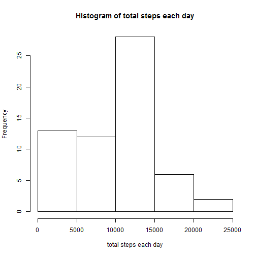
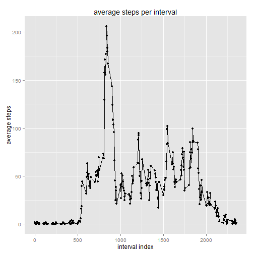
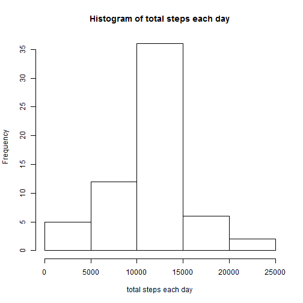
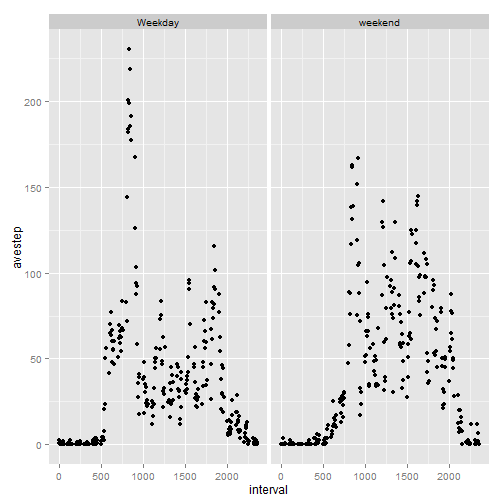

## Loading and preprocessing the data
The following code was used to load the data file, which was in csv format. In addition, the code also include packages required for the entire project.


```r
library(dplyr)
library(ggplot2)

activity=read.csv("activity.csv")
```


## What is mean total number of steps taken per day?
### 1. Calculate the total number of steps taken per day
The code for calculating the total number of steps taken per day is the following:

```r
# group the data by date
by_day<-group_by(activity,date)

#calculate the total steps per day
total_steps_perday<-summarize(by_day,totalsteps=sum(steps,na.rm=TRUE))
```

### 2. Make a histogram of the total number of steps taken each day
The histogram was generated using the following code: 

```r
hist(total_steps_perday$totalsteps,main="Histogram of total steps each day",xlab="total steps each day")
```

 

### 3. Calculate and report the mean and median of the total number of steps takenp per day
The code for calculating mean and median of the total number of steps taken per day is the following: 

```r
total_steps_mean <- mean(total_steps_perday$totalsteps,na.rm=TRUE)
total_steps_median <- median(total_steps_perday$totalsteps,na.rm=TRUE)
```
The mean and median of the total number of steps taken per day are 
9354 and 10395, respectively.


## What is the average daily activity pattern?
### 1. Make a time series plot of the 5-minute interval (x-axis) and the average number of steps taken, averaged across all days (y-axis)
The code is shown as the following:

```r
by_interval<-group_by(activity,interval)
average_steps_interval<-summarize(by_interval,averagesteps=mean(steps,na.rm=TRUE))
q=qplot(interval,averagesteps,data=average_steps_interval,main="average steps per interval", xlab="interval index", ylab="average steps")
q+geom_line()
```

 

### 2. Which 5-minute interval, on average across all the days in the dataset, contains the maximum number of steps?
The code is shown as the following:

```r
max_interval<-subset(average_steps_interval,averagesteps==max(average_steps_interval$averagesteps))$interval
```
The 5-minute interval that contains the maximum number of steps is 835, which is consistent to the plot of "average steps per interval"

## Imputing missing values
### 1. Calculate and report the total number of missing values in the dataset (i.e. the total number of rows with NAs)
The code is the following:

```r
missing_row_count<-sum(!complete.cases(activity))
```
The total number of rows with missing values in the dataset is 2304.

### 2. Devise a strategy for filling in all of the missing values in the dataset. The strategy does not need to be sophisticated.
The strategy in this document for the missing values is that for the  missing values in the dataset, we will use the mean for that 5-minute interval to replace the missing values.

### 3. Create a new dataset that is equal to the original dataset but with the missing data filled in.
The code is the following:

```r
#merge the activity dataset and the dataset containing the average steps for each time interval
merged_activity_avestep<-merge(activity,average_steps_interval)

# find the index of the rows that containing missing values
missing_row_index<-!complete.cases(merged_activity_avestep)

#replace the missing value by the averae steps of that time interval
merged_activity_avestep[missing_row_index,'steps']=merged_activity_avestep[missing_row_index,'averagesteps']

#return the data frame with the corresponding columns in the origin dataset
imputed_activity<-merged_activity_avestep[,1:3]
```
### 4. Make a histogram of the total number of steps taken each day and Calculate and report the mean and median total number of steps taken per day

```r
#group the imputed data by date
by_day_imputed<-group_by(imputed_activity,date)

#calculate the total steps for each day by summarize function of dplyr package
total_steps_perday_imputed<-summarize(by_day_imputed,totalsteps=sum(steps))

#draw the histogram of total steps per day
hist(total_steps_perday_imputed$totalsteps,main="Histogram of total steps each day",xlab="total steps each day")
```

 

```r
#calculate the mean and median of the total steps taken per day
total_steps_imputed_mean=mean(total_steps_perday_imputed$totalsteps)
total_steps_imputed_median=median(total_steps_perday_imputed$totalsteps)
```
After imputing the data, both mean and median of the total number of steps taken each day are 10766.19. This value is bigger than the mean and median of the total number of steps taken per day when missing values were not imputed. Therefore, imputing missing data increases the estimates of the total daily numbers of steps in terms of both mean and median values.


## Are there differences in activity patterns between weekdays and weekends?
### 1. Create a new factor variable in the dataset with two levels – “weekday” and “weekend” indicating whether a given date is a weekday or weekend day.
The code for adding a factor variable corresponding to "weekday" and "weekend" using the summarize function of dplyr package is the following. The weekdays() function was used to find if a given date was a weekday or weekend. This factor variable was then added to the dataset as an extra column.

```r
#add an extra column corresponding to weekdays or weekends of the date
weekday_activity<-mutate(imputed_activity, weekdaylevel=factor(1*(weekdays(as.Date(date),abbreviate=TRUE) %in% c('Sun','Sat')),labels = c("Weekday","weekend")))
```
### 2. Make a panel plot containing a time series plot (i.e. type = "l") of the 5-minute interval (x-axis) and the average number of steps taken, averaged across all weekday days or weekend days (y-axis).
The code for generating this plot is the following:

```r
#group the activity data by weekdaylevel and time interval
by_weekday_level_imputed<-group_by(weekday_activity,weekdaylevel,interval)

#calculate the average steps based on weekdaylevel and time interval
average_step_weekday<-summarize(by_weekday_level_imputed,avestep=mean(steps))

#plot the average steps for each time interval for weekdays and weekends, respectively.
q=qplot(data=average_step_weekday, x=interval,y=avestep)
q+facet_grid(.~weekdaylevel)
```

 

The panel plot was generated by qplot of the ggplot2 package. The dataset was first grouped by weekday level and time intervals, and then the averages of the setps per interval were plotted for weekday and weekend, respectively. According to this plot, there is an obvious difference in acitivity patterns between weekdays and weekends: 
First, the maximum average steps taken in weekdays is above 200, which is higher than that in weekends. Second, except for the extreme time interval regions (interval < 500 and interval >2000), the average steps taken in weekdays fluctuated more than those in weekends, indicating that people may take different types of activities during weekdays, while during the weekends, the intensity of the activities taken at different time interval regions are more similar to each other. 

